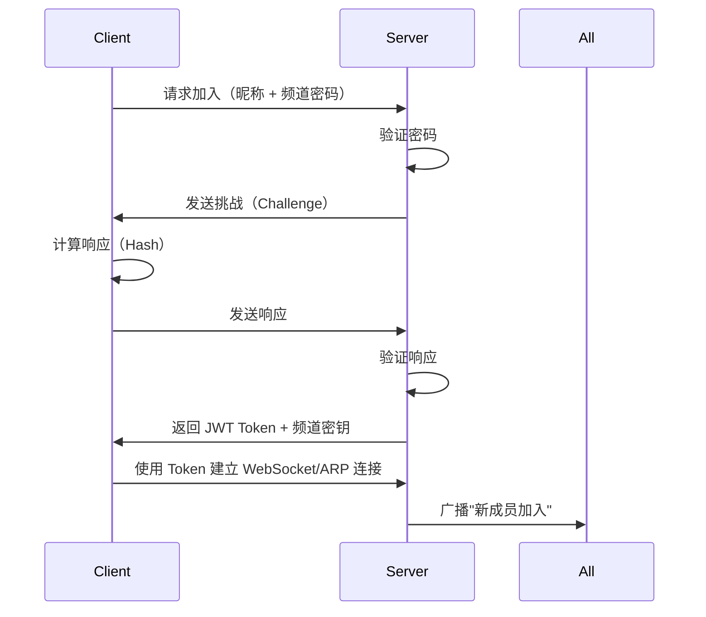

# CrossWire 功能规格文档

> CTF 线下赛通讯系统 - 功能详细说明
> 
> Version: 1.0.0  
> Date: 2025-10-05

---

## 📑 目录

- [1. 核心功能](#1-核心功能)
- [2. 用户功能](#2-用户功能)
- [3. 频道功能](#3-频道功能)
- [4. 消息功能](#4-消息功能)
- [5. 文件传输功能](#5-文件传输功能)
- [6. 成员管理功能](#6-成员管理功能)
- [7. 搜索与过滤功能](#7-搜索与过滤功能)
- [8. 界面功能](#8-界面功能)

---

## 1. 核心功能

### 1.1 双模式运行

#### 1.1.1 服务端模式

**功能描述：**
- 创建频道并作为中心节点
- 管理所有连接的客户端
- 转发消息和文件
- 保存历史记录

**使用流程：**
```
1. 启动应用 → 选择"创建频道"
2. 配置频道信息：
   - 频道名称
   - 频道密码（用于客户端加入）
   - 传输模式（ARP/HTTPS/mDNS）
   - 端口号（HTTPS 模式）
3. 点击"启动服务端"
4. 显示连接信息（IP、端口、二维码）
5. 等待客户端加入
```

**配置选项：**

| 选项 | 说明 | 默认值 | 必填 |
|------|------|--------|------|
| 频道名称 | 显示在客户端的频道标识 | "CTF-Team-[随机]" | 是 |
| 频道密码 | 客户端加入时验证 | 随机生成 | 是 |
| 传输模式 | ARP/HTTPS/mDNS | 自动检测 | 是 |
| 端口 | HTTPS 模式端口 | 8443 | HTTPS 时必填 |
| 网卡 | ARP 模式网卡 | 自动检测 | ARP 时必填 |
| 最大成员 | 频道最大人数 | 50 | 否 |
| 历史保留 | 保留历史消息天数 | 7 | 否 |

**权限：**
- 踢出成员
- 禁言成员
- 删除消息
- 置顶消息
- 修改频道设置
- 导出频道数据

---

#### 1.1.2 客户端模式

**功能描述：**
- 扫描或手动输入服务器地址
- 加入已存在的频道
- 收发消息和文件

**使用流程：**
```
1. 启动应用 → 选择"加入频道"
2. 选择发现方式：
   a. 自动扫描局域网服务器
   b. 手动输入服务器地址
   c. 扫描二维码
3. 输入频道密码
4. 输入个人信息：
   - 昵称
   - 头像（可选）
   - 技能标签
   - 角色
5. 点击"加入频道"
6. 验证成功后进入聊天界面
```

**配置选项：**

| 选项 | 说明 | 默认值 | 必填 |
|------|------|--------|------|
| 昵称 | 显示名称 | - | 是 |
| 头像 | 用户头像 | 默认头像 | 否 |
| 技能标签 | 如 "Web", "Pwn" | [] | 否 |
| 角色 | "队长", "队员", "替补" | "队员" | 否 |
| 个人简介 | 自我介绍 | "" | 否 |

---

### 1.2 传输模式选择

#### 1.2.1 ARP 模式（推荐）

**适用场景：**
- 同一局域网内
- 有管理员权限
- 追求极致速度

**特点：**
- ⚡ **极快**：1-3ms 延迟
- 🔒 **隐蔽**：二层通信，难以检测
- 🚀 **高吞吐**：50-100 MB/s 文件传输

**使用条件：**
- ✅ Windows: 管理员权限
- ✅ Linux: root 或 CAP_NET_RAW
- ✅ macOS: sudo

**自动检测流程：**
```
1. 检测操作系统权限
2. 枚举网络接口
3. 测试发送 ARP 帧
4. 如果成功 → 启用 ARP 模式
5. 如果失败 → 降级到 HTTPS
```

---

#### 1.2.2 HTTPS 模式（标准）

**适用场景：**
- 跨网络通信
- 无管理员权限
- 标准 CTF 环境

**特点：**
- 🔐 **安全**：TLS 1.3 加密
- 🌐 **通用**：任何网络环境
- 📱 **兼容**：支持所有平台

**使用条件：**
- ✅ 可访问的 IP 地址
- ✅ 开放的端口（默认 8443）
- ✅ TLS 证书（自动生成）

---

#### 1.2.3 mDNS 模式（Fallback）

**适用场景：**
- 极端受限网络
- 只有 DNS 流量可通过
- 临时应急通信

**特点：**
- 🎭 **隐蔽**：伪装成服务发现
- 🔓 **无限制**：仅需 UDP 5353
- 🐌 **慢速**：200-1000ms 延迟

**限制：**
- ⚠️ 仅适合小文件 (<500KB)
- ⚠️ 速度慢 (10-20 KB/s)
- ⚠️ 不可靠（需重传）

---

## 2. 用户功能

### 2.1 用户注册与认证

**客户端加入流程：**



**JWT Token 结构：**

```json
{
  "header": {
    "alg": "HS256",
    "typ": "JWT"
  },
  "payload": {
    "user_id": "uuid-v4",
    "nickname": "alice",
    "channel_id": "channel-uuid",
    "role": "member",
    "iat": 1696512000,
    "exp": 1696598400
  },
  "signature": "..."
}
```

---

### 2.2 个人资料管理

#### 2.2.1 基础信息

| 字段 | 类型 | 说明 | 可见性 |
|------|------|------|--------|
| 昵称 | String | 3-20 字符 | 所有人 |
| 用户 ID | UUID | 唯一标识 | 所有人 |
| 头像 | Image | JPG/PNG, 最大 2MB | 所有人 |
| 角色 | Enum | "队长"/"队员"/"替补" | 所有人 |
| 加入时间 | Timestamp | 自动记录 | 所有人 |

---

#### 2.2.2 CTF 专属信息

**技能标签：**

```go
type SkillTag struct {
    Category   string   // "Web", "Pwn", "Reverse", "Crypto", "Misc"
    Level      int      // 1-5 星级
    Experience int      // 相关题目数量
    LastUsed   time.Time
}

// 示例
{
    "Category": "Web",
    "Level": 4,
    "Experience": 150,
    "LastUsed": "2025-10-05T10:30:00Z"
}
```

**擅长领域：**

```go
type Expertise struct {
    Name        string   // "SQL注入", "XXE", "堆溢出"
    Description string   // 详细说明
    Tools       []string // 常用工具
    Notes       string   // 个人笔记链接
}

// 示例
{
    "Name": "SQL 注入",
    "Description": "擅长时间盲注和堆叠查询",
    "Tools": ["sqlmap", "自写脚本"],
    "Notes": "https://notes.local/sqli"
}
```

**状态管理：**

| 状态 | 图标 | 说明 | 自动切换 |
|------|------|------|----------|
| 在线 | 🟢 | 活跃状态 | - |
| 忙碌 | 🔴 | 正在解题 | 手动设置 |
| 离开 | 🟡 | 暂时离开 | 5 分钟无操作 |
| 离线 | ⚫ | 已断开 | 连接断开 |

**当前任务：**

```go
type CurrentTask struct {
    Challenge   string      // "Web-100 登录绕过"
    StartTime   time.Time   // 开始时间
    Progress    int         // 0-100%
    Notes       string      // 简短进度说明
    Teammates   []string    // 协作队友
}

// 示例
{
    "Challenge": "Pwn-300 栈溢出",
    "StartTime": "2025-10-05T11:00:00Z",
    "Progress": 60,
    "Notes": "已拿到 shell，正在提权",
    "Teammates": ["bob", "charlie"]
}
```

---

### 2.3 用户在线状态

**状态同步机制：**

```go
// 客户端每 30 秒发送心跳
type Heartbeat struct {
    UserID      string
    Status      UserStatus
    CurrentTask *CurrentTask
    Timestamp   time.Time
}

// 服务端检测
func (s *Server) CheckOnlineStatus() {
    ticker := time.NewTicker(60 * time.Second)
    for range ticker.C {
        for userID, user := range s.users {
            if time.Since(user.LastHeartbeat) > 90*time.Second {
                user.Status = StatusOffline
                s.BroadcastStatusChange(userID, StatusOffline)
            }
        }
    }
}
```

---

## 3. 频道功能

### 3.1 频道创建

**创建参数：**

```go
type ChannelConfig struct {
    Name            string        // 频道名称
    Password        string        // 加入密码
    MaxMembers      int           // 最大成员数
    TransportMode   TransportMode // ARP/HTTPS/mDNS
    Port            int           // HTTPS 端口
    Interface       string        // ARP 网卡
    HistoryRetention int          // 历史保留天数
    
    // 高级选项
    AllowFileUpload bool          // 允许文件上传
    MaxFileSize     int64         // 最大文件大小
    EnableVoice     bool          // 语音功能（未来）
    EnableScreen    bool          // 屏幕共享（未来）
}
```

**频道元数据：**

```go
type Channel struct {
    ID              string
    Name            string
    CreatedAt       time.Time
    CreatorID       string
    
    // 成员信息
    Members         map[string]*Member
    OnlineCount     int
    
    // 统计信息
    MessageCount    int64
    FileCount       int64
    TotalTraffic    uint64
    
    // 安全
    PasswordHash    string
    EncryptionKey   []byte
}
```

---

### 3.2 频道加入验证

**验证流程：**

1. **密码验证（第一层）**
```go
func (c *Channel) VerifyPassword(password string) bool {
    hash := sha256.Sum256([]byte(password + c.Salt))
    return bytes.Equal(hash[:], c.PasswordHash)
}
```

2. **Challenge-Response（第二层）**
```go
// 防止重放攻击
func (c *Channel) GenerateChallenge() *Challenge {
    return &Challenge{
        Nonce:     generateRandomBytes(32),
        Timestamp: time.Now().Unix(),
        ExpiresIn: 60, // 60 秒过期
    }
}

func (c *Channel) VerifyResponse(resp *ChallengeResponse) bool {
    expectedHash := sha256.Sum256(append(
        resp.Nonce,
        []byte(resp.UserID),
        c.EncryptionKey...,
    ))
    return bytes.Equal(expectedHash[:], resp.Hash)
}
```

3. **Token 签发（第三层）**
```go
func (c *Channel) IssueToken(userID string) (string, error) {
    claims := jwt.MapClaims{
        "user_id":    userID,
        "channel_id": c.ID,
        "role":       "member",
        "iat":        time.Now().Unix(),
        "exp":        time.Now().Add(24 * time.Hour).Unix(),
    }
    
    token := jwt.NewWithClaims(jwt.SigningMethodHS256, claims)
    return token.SignedString(c.JWTSecret)
}
```

---

### 3.3 频道权限管理

**角色定义：**

```go
type Role int

const (
    RoleOwner    Role = iota  // 频道创建者
    RoleAdmin                 // 管理员
    RoleMember                // 普通成员
    RoleReadOnly              // 只读成员（被禁言）
)

type Permission int

const (
    PermSendMessage     Permission = 1 << iota  // 发送消息
    PermSendFile                                // 发送文件
    PermDeleteMessage                           // 删除消息
    PermKickMember                              // 踢出成员
    PermMuteMember                              // 禁言成员
    PermPinMessage                              // 置顶消息
    PermModifyChannel                           // 修改频道设置
    PermExportData                              // 导出数据
)

var RolePermissions = map[Role]Permission{
    RoleOwner: PermSendMessage | PermSendFile | PermDeleteMessage |
               PermKickMember | PermMuteMember | PermPinMessage |
               PermModifyChannel | PermExportData,
    
    RoleAdmin: PermSendMessage | PermSendFile | PermDeleteMessage |
               PermKickMember | PermMuteMember | PermPinMessage,
    
    RoleMember: PermSendMessage | PermSendFile,
    
    RoleReadOnly: 0,  // 无权限
}
```

**权限检查：**

```go
func (m *Member) HasPermission(perm Permission) bool {
    return RolePermissions[m.Role]&perm != 0
}

// 使用示例
if !member.HasPermission(PermDeleteMessage) {
    return ErrPermissionDenied
}
```

---

## 4. 消息功能

### 4.1 消息类型

#### 4.1.1 文本消息

**支持格式：**
- ✅ 纯文本
- ✅ Markdown
- ✅ Emoji（:smile:）
- ✅ @提及（@username）
- ✅ #标签（#web #pwn）

**示例：**

```markdown
发现一个 SQL 注入点：
`http://target.com/login?id=1' OR '1'='1`

已经绕过了 WAF，使用了这个 payload:
```python
import requests
url = "http://target.com/api"
payload = {"id": "1' UNION SELECT..."}
```

@bob 你来试试盲注

#web #sqli
```

**渲染效果：**
- 代码块自动高亮
- @提及高亮并发送通知
- #标签可点击过滤

---

#### 4.1.2 代码消息

**专门的代码分享格式：**

```go
type CodeMessage struct {
    Language    string   // "python", "c", "bash"
    Code        string   // 代码内容
    Filename    string   // 文件名（可选）
    Description string   // 代码说明
    Highlighted bool     // 是否语法高亮
}

// 示例
{
    "Language": "python",
    "Code": "#!/usr/bin/env python3\nimport pwn\n...",
    "Filename": "exploit.py",
    "Description": "Pwn-300 的 exp 脚本",
    "Highlighted": true
}
```

**支持语言：**
- Python, C/C++, Go, Rust
- JavaScript, PHP
- Bash, PowerShell
- Assembly (x86, ARM)

**功能：**
- ✅ 语法高亮
- ✅ 行号显示
- ✅ 一键复制
- ✅ 运行预览（Python 沙箱）
- ✅ 语法检查

---

#### 4.1.3 文件消息

```go
type FileMessage struct {
    FileID      string
    Filename    string
    Size        int64
    MimeType    string
    SHA256      string      // 文件哈希
    Thumbnail   []byte      // 缩略图（图片/视频）
    UploadTime  time.Time
    ExpiresAt   time.Time   // 过期时间
}
```

**文件预览：**

| 文件类型 | 预览方式 |
|---------|---------|
| 图片 (jpg, png, gif) | 内联显示缩略图 |
| PDF | 首页缩略图 |
| 文本 (txt, md, log) | 前 20 行预览 |
| 压缩包 (zip, tar.gz) | 文件列表 |
| 二进制 | Hex 预览（前 256 字节）|

---

#### 4.1.4 系统消息

```go
type SystemMessage struct {
    Type      SystemMessageType
    ActorID   string  // 操作者
    TargetID  string  // 目标对象
    Extra     map[string]interface{}
}

type SystemMessageType int

const (
    SysMsgMemberJoin    SystemMessageType = iota  // 成员加入
    SysMsgMemberLeave                             // 成员离开
    SysMsgMemberKicked                            // 成员被踢
    SysMsgMemberMuted                             // 成员被禁言
    SysMsgMessagePinned                           // 消息置顶
    SysMsgMessageDeleted                          // 消息删除
    SysMsgChannelUpdated                          // 频道更新
    SysMsgFileUploaded                            // 文件上传
)
```

**显示示例：**
```
🎉 alice 加入了频道
🚪 bob 离开了频道
🚫 charlie 被 admin 踢出频道（原因：刷屏）
📌 admin 置顶了一条消息
📁 david 上传了文件 exploit.py
```

---

### 4.2 消息发送与接收

#### 4.2.1 发送流程

```go
func (c *Client) SendMessage(content string, msgType MessageType) error {
    // 1. 构造消息
    msg := &Message{
        ID:        uuid.New().String(),
        ChannelID: c.channelID,
        SenderID:  c.userID,
        Type:      msgType,
        Content:   content,
        Timestamp: time.Now(),
    }
    
    // 2. 序列化
    data, err := msg.Marshal()
    if err != nil {
        return err
    }
    
    // 3. 加密
    encrypted, err := c.crypto.Encrypt(data)
    if err != nil {
        return err
    }
    
    // 4. 通过传输层发送
    return c.transport.SendMessage(&TransportMessage{
        Type:    TxMsgData,
        Payload: encrypted,
    })
}
```

#### 4.2.2 接收流程

```go
func (c *Client) ReceiveLoop() {
    for {
        // 1. 从传输层接收
        txMsg, err := c.transport.ReceiveMessage()
        if err != nil {
            return
        }
        
        // 2. 解密
        decrypted, err := c.crypto.Decrypt(txMsg.Payload)
        if err != nil {
            continue
        }
        
        // 3. 反序列化
        msg := &Message{}
        if err := msg.Unmarshal(decrypted); err != nil {
            continue
        }
        
        // 4. 验证签名
        if !c.verifyMessageSignature(msg) {
            continue
        }
        
        // 5. 投递到UI层
        c.messageHandler(msg)
    }
}
```

---

### 4.3 消息同步与历史

#### 4.3.1 离线消息同步

**客户端重连后：**

```go
func (c *Client) SyncMessages() error {
    // 请求最后一条消息之后的所有消息
    req := &SyncRequest{
        ChannelID:      c.channelID,
        LastMessageID:  c.lastMessageID,
        LastTimestamp:  c.lastSyncTime,
    }
    
    resp, err := c.RequestSync(req)
    if err != nil {
        return err
    }
    
    // 批量处理历史消息
    for _, msg := range resp.Messages {
        c.processMessage(msg)
    }
    
    c.lastSyncTime = time.Now()
    return nil
}
```

**服务端实现：**

```go
func (s *Server) HandleSyncRequest(req *SyncRequest) (*SyncResponse, error) {
    // 从数据库查询增量消息
    messages, err := s.db.GetMessagesSince(
        req.ChannelID,
        req.LastTimestamp,
        1000, // 最多返回 1000 条
    )
    
    return &SyncResponse{
        Messages: messages,
        HasMore:  len(messages) == 1000,
    }, nil
}
```

---

#### 4.3.2 消息搜索

**搜索参数：**

```go
type SearchQuery struct {
    ChannelID   string
    Keyword     string      // 关键词
    SenderID    string      // 发送者筛选
    Type        MessageType // 消息类型筛选
    StartTime   time.Time   // 时间范围
    EndTime     time.Time
    Tags        []string    // 标签筛选
    Limit       int
    Offset      int
}
```

**全文搜索（SQLite FTS5）：**

```sql
-- 创建全文索引
CREATE VIRTUAL TABLE messages_fts USING fts5(
    content,
    sender_nickname,
    tags,
    content=messages,
    content_rowid=id
);

-- 搜索示例
SELECT m.* FROM messages m
JOIN messages_fts fts ON m.id = fts.rowid
WHERE messages_fts MATCH 'sql AND injection'
AND m.channel_id = ?
AND m.timestamp BETWEEN ? AND ?
ORDER BY rank
LIMIT 50;
```

---

### 4.4 消息交互功能

#### 4.4.1 消息回复/引用

```go
type MessageReply struct {
    MessageID       string   // 当前消息 ID
    ReplyToID       string   // 回复的消息 ID
    ReplyToContent  string   // 被回复消息的内容片段
    ReplyToSender   string   // 被回复消息的发送者
}
```

**UI 显示：**
```
┌─────────────────────────────────┐
│ alice: 发现一个 SQL 注入点      │
│ 10:30                           │
└─────────────────────────────────┘
  ↓ 回复
┌─────────────────────────────────┐
│ ┌─ 回复 alice ──────────────┐  │
│ │ 发现一个 SQL 注入点...    │  │
│ └────────────────────────────┘  │
│ bob: 我来试试盲注              │
│ 10:32                           │
└─────────────────────────────────┘
```

---

#### 4.4.2 消息置顶

```go
type PinnedMessage struct {
    MessageID   string
    PinnedBy    string      // 操作者
    PinnedAt    time.Time
    Reason      string      // 置顶原因
}

func (c *Channel) PinMessage(msgID string, operatorID string, reason string) error {
    // 权限检查
    member := c.Members[operatorID]
    if !member.HasPermission(PermPinMessage) {
        return ErrPermissionDenied
    }
    
    // 最多 5 条置顶
    if len(c.PinnedMessages) >= 5 {
        return ErrTooManyPinnedMessages
    }
    
    c.PinnedMessages = append(c.PinnedMessages, &PinnedMessage{
        MessageID: msgID,
        PinnedBy:  operatorID,
        PinnedAt:  time.Now(),
        Reason:    reason,
    })
    
    // 广播置顶事件
    c.BroadcastSystemMessage(SysMsgMessagePinned, operatorID, msgID)
    
    return nil
}
```

---

#### 4.4.3 消息删除

```go
func (c *Channel) DeleteMessage(msgID string, operatorID string) error {
    msg := c.GetMessage(msgID)
    if msg == nil {
        return ErrMessageNotFound
    }
    
    member := c.Members[operatorID]
    
    // 权限检查：自己的消息 或 有删除权限
    if msg.SenderID != operatorID && !member.HasPermission(PermDeleteMessage) {
        return ErrPermissionDenied
    }
    
    // 软删除（保留记录但标记为已删除）
    msg.Deleted = true
    msg.DeletedBy = operatorID
    msg.DeletedAt = time.Now()
    
    // 更新数据库
    c.db.UpdateMessage(msg)
    
    // 广播删除事件
    c.BroadcastMessageDeleted(msgID)
    
    return nil
}
```

---

## 5. 文件传输功能

### 5.1 文件上传

#### 5.1.1 上传流程

**分块上传：**

```go
type FileUpload struct {
    ID          string
    Filename    string
    Size        int64
    MimeType    string
    ChunkSize   int       // 分块大小
    TotalChunks int       // 总块数
    Uploaded    int       // 已上传块数
    Status      UploadStatus
}

type UploadStatus int

const (
    UploadStatusPending UploadStatus = iota
    UploadStatusUploading
    UploadStatusCompleted
    UploadStatusFailed
)

func (c *Client) UploadFile(filePath string) error {
    // 1. 打开文件
    file, err := os.Open(filePath)
    if err != nil {
        return err
    }
    defer file.Close()
    
    // 2. 获取文件信息
    stat, _ := file.Stat()
    chunkSize := c.getOptimalChunkSize()  // 根据传输模式决定
    totalChunks := int(math.Ceil(float64(stat.Size()) / float64(chunkSize)))
    
    // 3. 创建上传任务
    upload := &FileUpload{
        ID:          uuid.New().String(),
        Filename:    filepath.Base(filePath),
        Size:        stat.Size(),
        MimeType:    mime.TypeByExtension(filepath.Ext(filePath)),
        ChunkSize:   chunkSize,
        TotalChunks: totalChunks,
        Status:      UploadStatusPending,
    }
    
    // 4. 分块上传
    for i := 0; i < totalChunks; i++ {
        chunk := make([]byte, chunkSize)
        n, _ := file.Read(chunk)
        chunk = chunk[:n]
        
        // 加密分块
        encrypted, _ := c.crypto.Encrypt(chunk)
        
        // 发送分块
        err := c.transport.SendFileChunk(&FileChunk{
            FileID:     upload.ID,
            ChunkIndex: i,
            TotalChunks: totalChunks,
            Data:       encrypted,
            Checksum:   sha256.Sum256(chunk),
        })
        
        if err != nil {
            upload.Status = UploadStatusFailed
            return err
        }
        
        upload.Uploaded++
        c.onUploadProgress(upload)
    }
    
    upload.Status = UploadStatusCompleted
    return nil
}
```

**根据传输模式选择块大小：**

```go
func (c *Client) getOptimalChunkSize() int {
    switch c.transport.GetMode() {
    case TransportARP:
        return 1470  // 以太网 MTU
    case TransportHTTPS:
        return 64 * 1024  // 64KB
    case TransportMDNS:
        return 200  // 极小块
    default:
        return 32 * 1024
    }
}
```

---

#### 5.1.2 断点续传

```go
type FileUploadState struct {
    FileID          string
    UploadedChunks  []bool    // 每块的上传状态
    LastUpdateTime  time.Time
}

func (c *Client) ResumeUpload(fileID string) error {
    // 1. 加载上传状态
    state, err := c.loadUploadState(fileID)
    if err != nil {
        return err
    }
    
    // 2. 找到未上传的块
    for i, uploaded := range state.UploadedChunks {
        if !uploaded {
            // 重新上传该块
            chunk := c.readFileChunk(fileID, i)
            c.uploadChunk(fileID, i, chunk)
            
            state.UploadedChunks[i] = true
            c.saveUploadState(state)
        }
    }
    
    return nil
}
```

---

### 5.2 文件下载

#### 5.2.1 下载流程

```go
func (c *Client) DownloadFile(fileID string, savePath string) error {
    // 1. 请求文件元数据
    meta, err := c.RequestFileMetadata(fileID)
    if err != nil {
        return err
    }
    
    // 2. 创建本地文件
    file, err := os.Create(savePath)
    if err != nil {
        return err
    }
    defer file.Close()
    
    // 3. 接收分块并写入
    assembler := NewFileAssembler(meta.TotalChunks)
    
    for i := 0; i < meta.TotalChunks; i++ {
        chunk, err := c.transport.ReceiveFileChunk()
        if err != nil {
            return err
        }
        
        // 解密
        decrypted, _ := c.crypto.Decrypt(chunk.Data)
        
        // 验证校验和
        checksum := sha256.Sum256(decrypted)
        if !bytes.Equal(checksum[:], chunk.Checksum[:]) {
            return ErrChecksumMismatch
        }
        
        // 写入文件
        file.WriteAt(decrypted, int64(chunk.ChunkIndex)*int64(meta.ChunkSize))
        
        assembler.MarkReceived(i)
        c.onDownloadProgress(assembler.Progress())
    }
    
    return nil
}
```

---

### 5.3 文件预览与缩略图

#### 5.3.1 图片缩略图生成

```go
import "github.com/nfnt/resize"

func GenerateThumbnail(imagePath string, maxWidth uint) ([]byte, error) {
    // 打开图片
    file, _ := os.Open(imagePath)
    defer file.Close()
    
    img, _, _ := image.Decode(file)
    
    // 调整大小
    thumbnail := resize.Thumbnail(maxWidth, maxWidth, img, resize.Lanczos3)
    
    // 编码为 JPEG
    var buf bytes.Buffer
    jpeg.Encode(&buf, thumbnail, &jpeg.Options{Quality: 85})
    
    return buf.Bytes(), nil
}
```

#### 5.3.2 文本文件预览

```go
func PreviewTextFile(filePath string, maxLines int) (string, error) {
    file, _ := os.Open(filePath)
    defer file.Close()
    
    scanner := bufio.NewScanner(file)
    lines := []string{}
    
    for i := 0; i < maxLines && scanner.Scan(); i++ {
        lines = append(lines, scanner.Text())
    }
    
    preview := strings.Join(lines, "\n")
    
    if scanner.Scan() {
        preview += "\n... (more content)"
    }
    
    return preview, nil
}
```

---

## 6. 成员管理功能

### 6.1 成员列表

**展示信息：**

```go
type MemberListItem struct {
    UserID          string
    Nickname        string
    Avatar          string
    Status          UserStatus
    Role            Role
    
    // CTF 相关
    Skills          []SkillTag
    CurrentTask     *CurrentTask
    Expertise       []Expertise
    
    // 统计
    MessageCount    int
    FilesShared     int
    OnlineTime      time.Duration
    JoinTime        time.Time
}
```

**排序方式：**

- 在线优先（在线 > 忙碌 > 离开 > 离线）
- 角色优先（队长 > 管理员 > 队员）
- 活跃度优先（消息数量）
- 加入时间（最早加入在前）

---

### 6.2 成员操作

#### 6.2.1 踢出成员

```go
func (c *Channel) KickMember(memberID string, operatorID string, reason string) error {
    // 权限检查
    operator := c.Members[operatorID]
    if !operator.HasPermission(PermKickMember) {
        return ErrPermissionDenied
    }
    
    member := c.Members[memberID]
    if member == nil {
        return ErrMemberNotFound
    }
    
    // 不能踢出创建者
    if member.Role == RoleOwner {
        return ErrCannotKickOwner
    }
    
    // 管理员不能踢出其他管理员
    if operator.Role != RoleOwner && member.Role == RoleAdmin {
        return ErrPermissionDenied
    }
    
    // 记录踢出日志
    c.AddLog(&AuditLog{
        Type:      LogTypeKick,
        OperatorID: operatorID,
        TargetID:   memberID,
        Reason:     reason,
        Timestamp:  time.Now(),
    })
    
    // 移除成员
    delete(c.Members, memberID)
    
    // 断开连接
    c.DisconnectMember(memberID)
    
    // 广播系统消息
    c.BroadcastSystemMessage(SysMsgMemberKicked, operatorID, memberID)
    
    return nil
}
```

---

#### 6.2.2 禁言成员

```go
type MuteRecord struct {
    MemberID    string
    MutedBy     string
    MutedAt     time.Time
    Duration    time.Duration  // 0 表示永久
    Reason      string
}

func (c *Channel) MuteMember(memberID string, operatorID string, duration time.Duration, reason string) error {
    operator := c.Members[operatorID]
    if !operator.HasPermission(PermMuteMember) {
        return ErrPermissionDenied
    }
    
    member := c.Members[memberID]
    member.Role = RoleReadOnly
    
    muteRecord := &MuteRecord{
        MemberID: memberID,
        MutedBy:  operatorID,
        MutedAt:  time.Now(),
        Duration: duration,
        Reason:   reason,
    }
    
    c.MuteRecords[memberID] = muteRecord
    
    // 定时解除禁言
    if duration > 0 {
        time.AfterFunc(duration, func() {
            c.UnmuteMember(memberID)
        })
    }
    
    c.BroadcastSystemMessage(SysMsgMemberMuted, operatorID, memberID)
    
    return nil
}
```

---

## 7. 搜索与过滤功能

### 7.1 消息搜索

**搜索界面：**

```
┌─────────────────────────────────────┐
│ 🔍 搜索消息                         │
├─────────────────────────────────────┤
│ 关键词: [sql injection_______]      │
│ 发送者: [@alice_______________]      │
│ 时间范围: [2025-10-01] ~ [2025-10-05] │
│ 消息类型: ☑文本 ☑代码 ☐文件       │
│ 标签: [#web] [#sqli]                │
│                                     │
│ [搜索]  [重置]                      │
└─────────────────────────────────────┘

搜索结果 (15)
┌─────────────────────────────────────┐
│ alice  2025-10-05 10:30            │
│ 发现一个 SQL 注入点：              │
│ `id=1' OR '1'='1`                  │
│ #web #sqli                         │
└─────────────────────────────────────┘
```

---

### 7.2 成员筛选

**筛选条件：**

```go
type MemberFilter struct {
    Status      []UserStatus   // 状态筛选
    Skills      []string       // 技能筛选
    Role        []Role         // 角色筛选
    Online      bool           // 只显示在线
    Available   bool           // 只显示空闲（非忙碌）
}

func (c *Channel) FilterMembers(filter *MemberFilter) []*Member {
    var result []*Member
    
    for _, member := range c.Members {
        if filter.Online && member.Status == StatusOffline {
            continue
        }
        
        if filter.Available && member.Status == StatusBusy {
            continue
        }
        
        if len(filter.Skills) > 0 {
            hasSkill := false
            for _, skill := range filter.Skills {
                if member.HasSkill(skill) {
                    hasSkill = true
                    break
                }
            }
            if !hasSkill {
                continue
            }
        }
        
        result = append(result, member)
    }
    
    return result
}
```

---

## 8. 界面功能

### 8.1 聊天界面布局

```
┌─────────────────────────────────────────────────────────────┐
│  CrossWire - CTF Team Chat                          [_ □ ×]  │
├────────┬────────────────────────────────────────────────────┤
│        │  Web-100 登录绕过                                  │
│  频道  │  #web-challenges                                   │
│  列表  ├────────────────────────────────────────────────────┤
│        │  📌 置顶消息：                                     │
│ • 主频道 │  admin: 比赛规则和注意事项                        │
│ • web │  ────────────────────────────────────────────────  │
│ • pwn │                                                    │
│ • misc │  alice  10:30                        [回复] [📎]  │
│        │  发现一个 SQL 注入点                              │
│        │  `id=1' OR '1'='1`                               │
│        │  #web #sqli                                       │
│        │                                                    │
│        │  bob  10:32                          [回复] [📎]  │
│        │  ┌─ 回复 alice ────────────────────┐             │
│        │  │ 发现一个 SQL 注入点...          │             │
│        │  └─────────────────────────────────┘             │
│        │  我来试试盲注，稍等                              │
│        │                                                    │
│        │  charlie  10:35  📁 exploit.py                   │
│        │  写好了自动化脚本                                 │
│        │  [下载] [预览]                                    │
│        │                                                    │
├────────┴────────────────────────────────────────────────────┤
│  [@提及] [#标签] [📎文件] [</> 代码] [😀 Emoji]            │
│  ┌───────────────────────────────────────────────────────┐ │
│  │ 输入消息...                                           │ │
│  └───────────────────────────────────────────────────────┘ │
│                                              [发送 (Ctrl+Enter)] │
└─────────────────────────────────────────────────────────────┘
```

---

### 8.2 成员信息侧边栏

```
┌────────────────────────┐
│  在线成员 (5/8)        │
├────────────────────────┤
│  🟢 alice (队长)       │
│     Web • Crypto       │
│     正在做: Web-300    │
│     [查看详情] [@提及] │
│                        │
│  🔴 bob (队员)         │
│     Pwn • Reverse      │
│     忙碌中             │
│                        │
│  🟢 charlie (队员)     │
│     Misc • Forensics   │
│     空闲               │
├────────────────────────┤
│  离线成员 (3)          │
│  ⚫ david              │
│  ⚫ eve                │
│  ⚫ frank              │
└────────────────────────┘
```

---

### 8.3 快捷键

| 快捷键 | 功能 |
|--------|------|
| `Ctrl + Enter` | 发送消息 |
| `Ctrl + K` | 快速搜索 |
| `Ctrl + F` | 搜索当前频道消息 |
| `Ctrl + U` | 上传文件 |
| `Ctrl + /` | 显示快捷键列表 |
| `@name` | 提及成员（自动补全）|
| `#tag` | 添加标签 |
| ` ``` ` | 代码块 |
| `Ctrl + B` | 粗体 |
| `Ctrl + I` | 斜体 |
| `Up Arrow` | 编辑上一条消息 |
| `Esc` | 关闭弹窗/取消操作 |

---

## 9. 高级功能

### 9.1 消息转发

```go
func (c *Client) ForwardMessage(msgID string, targetChannelID string) error {
    originalMsg := c.GetMessage(msgID)
    if originalMsg == nil {
        return ErrMessageNotFound
    }
    
    forwardedMsg := &Message{
        ID:        uuid.New().String(),
        ChannelID: targetChannelID,
        SenderID:  c.userID,
        Type:      MessageTypeForwarded,
        Content:   originalMsg.Content,
        Metadata: map[string]string{
            "original_sender": originalMsg.SenderID,
            "original_time":   originalMsg.Timestamp.String(),
        },
        Timestamp: time.Now(),
    }
    
    return c.SendMessage(forwardedMsg)
}
```

---

### 9.2 消息导出

```go
func (c *Channel) ExportMessages(startTime, endTime time.Time, format ExportFormat) ([]byte, error) {
    messages := c.db.GetMessagesBetween(c.ID, startTime, endTime)
    
    switch format {
    case ExportFormatJSON:
        return json.MarshalIndent(messages, "", "  ")
    
    case ExportFormatMarkdown:
        var md strings.Builder
        md.WriteString(fmt.Sprintf("# %s 消息记录\n\n", c.Name))
        md.WriteString(fmt.Sprintf("导出时间: %s\n\n", time.Now().Format(time.RFC3339)))
        
        for _, msg := range messages {
            md.WriteString(fmt.Sprintf("## %s - %s\n\n", 
                msg.SenderNickname, 
                msg.Timestamp.Format("2006-01-02 15:04:05")))
            md.WriteString(msg.Content + "\n\n")
        }
        
        return []byte(md.String()), nil
    
    case ExportFormatHTML:
        // TODO: HTML 模板渲染
        return nil, ErrNotImplemented
    }
    
    return nil, ErrUnsupportedFormat
}
```

---

## 10. 性能优化

### 10.1 消息懒加载

```go
// 只加载最近 50 条消息
func (c *Client) LoadInitialMessages() error {
    messages, err := c.db.GetRecentMessages(c.channelID, 50)
    if err != nil {
        return err
    }
    
    c.displayMessages(messages)
    return nil
}

// 滚动到顶部时加载更多
func (c *Client) LoadMoreMessages(beforeMessageID string) error {
    messages, err := c.db.GetMessagesBefore(c.channelID, beforeMessageID, 50)
    if err != nil {
        return err
    }
    
    c.prependMessages(messages)
    return nil
}
```

---

### 10.2 图片懒加载

```go
// 先加载缩略图
func (c *Client) LoadMessageImages(messages []*Message) {
    for _, msg := range messages {
        if msg.Type == MessageTypeImage {
            // 异步加载缩略图
            go func(m *Message) {
                thumbnail := c.downloadThumbnail(m.FileID)
                c.updateMessageThumbnail(m.ID, thumbnail)
            }(msg)
        }
    }
}

// 点击后加载原图
func (c *Client) LoadFullImage(fileID string) {
    fullImage := c.downloadFullImage(fileID)
    c.displayImageViewer(fullImage)
}
```

---

## 总结

CrossWire 提供了完整的 CTF 团队协作功能，包括：

✅ **双模式运行**：服务端/客户端灵活切换  
✅ **三种传输**：ARP/HTTPS/mDNS 自动选择  
✅ **丰富消息**：文本/代码/文件/系统消息  
✅ **成员管理**：技能标签、状态同步、权限控制  
✅ **文件传输**：分块上传、断点续传、预览  
✅ **搜索过滤**：全文搜索、成员筛选  
✅ **实时同步**：离线消息、增量同步  
✅ **安全加密**：端到端 X25519  

---

**下一步：参考其他文档**
- [PROTOCOL.md](PROTOCOL.md) - 通信协议详细说明
- [ARCHITECTURE.md](ARCHITECTURE.md) - 系统架构设计
- [DATABASE.md](DATABASE.md) - 数据库设计
